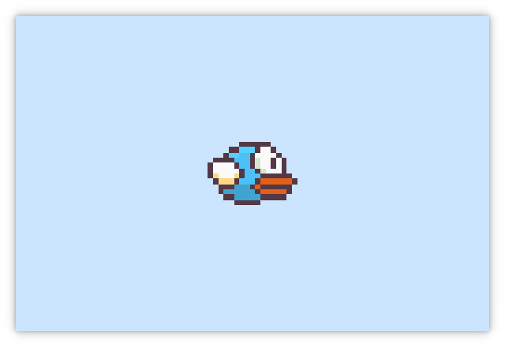

# Basics

A simple game with a controllable player and a menu described in the basics section of the documentation.

## Screenshots




## Run

To run this example :

```sh
python3 main.py
```

This command has to be executed from this directory (otherwise resources won't be found).
